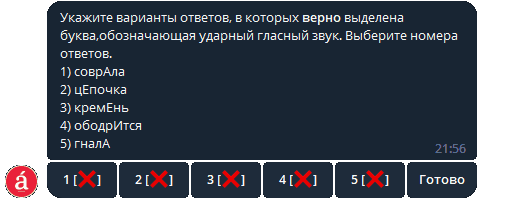
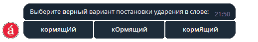
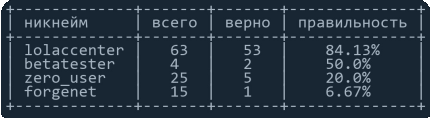

# Accents


Телеграм бот, позволяющий в удобной форме учить ударения для 4 задания ЕГЭ по русскому языку. С его помощью можно тренироваться в соблюдении орфоэпических норм. Бот использует данные из словаря ударений ФИПИ для генерации тестов и заданий.

Проект был создан на основе фреймворка aiogram. Aiogram принуждает отправлять и получать данные асинхронно, что в свою очередь позволяет боту работать с несколькими клиентами одновременно.

Для хранения данных был использован фреймворк Sqlalchemy, который позволяет обращаться к базам данных используя объектно-реляционное отображение.

## Возможности 📌
### Генерация заданий ЕГЭ:


### Генерация тестов:


### Таблица лидеров:


### Список ударений:


## Стэк разработки 💻

- **Языки:**
  - [Python 3.10](https://www.python.org/downloads/release/python-3100)
- **Telegram:**
  - [Aiogram](https://docs.aiogram.dev/en/latest)
- **База данных:**
  - [Sqlalchemy](https://docs.sqlalchemy.org/en/14)
- **Логирование:**
  - [Loguru](https://loguru.readthedocs.io/en/stable/index.html)

## Руководство по установке 🛠

1. Склонируйте репозиторий
2. Создайте [venv](https://pythonchik.ru/okruzhenie-i-pakety/virtualnoe-okruzhenie-python-venv)
3. Установите зависимостм:
   ```
   pip install --upgrade pip
   pip install -r requirements.txt
   ```
4. Запустите [run.py](main.py)
5. Введите токен бота

## Ссылки 💡
- **Бот:**
  - [AccentsBot](https://t.me/learn_accents_bot)
- **Использованная документация:**
  - [GrooshaAiogram](https://mastergroosha.github.io/aiogram-3-guide/quickstart)
  - [KlepikovSqlalchemy](https://konstantinklepikov.github.io/myknowlegebase/notes/sqlalchemy-docs.html)
- **Использованные примеры:**
  - [AdvancedUserTelegramBot](https://github.com/BaggerFast/AdvancedUserTelegramBot)
